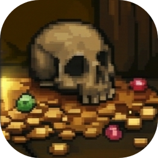

THE ULTIMATE RPG ADVENTURE GAME with swords and boss battles and other cool stuff OMG how do I make the FONT smaller

Team
Interniminabili
Daniela Andreea Fuiorea - Role: Dev
Adriana Costache - Role: Artist
Bogdan Cristian Baciu - Role: Game Designer
Dragos Cristian Odobescu - Role: Dev
Nicusor Vlad Gherghel - Role: Game Designer

Game Description
Built around the theme "The part you don't see", the concept is split into two distinct perspectives:

1. The Player's Perspective : As a gamer, you only see monsters as targets. You never see their private lives, their daily struggles, or the grueling work it takes behind the scenes to keep a dungeon running and ready for player raids.

2. The Lore Perspective: You play as Mirel, a low-level skeleton tired of being tutorial cannon fodder. He begs the dungeon Boss for power, but instead of magic, he receives a mop and endless cleaning tasks. The part Mirel doesn't see is that his Boss is pulling a "Karate Kid" on him—secretly training him through these mundane chores. Mirel only realizes this after the Boss is tragically killed by the Hero. Armed with the combat skills he didn't know he was learning, Mirel must use his cleaning techniques to avenge his master and become the new Boss.

Engine & Languages Used
Engine: Unreal Engine 5.8
Language / System: Blueprints Visual Scripting, PaperZD

Gameplay Instructions
The game's structure is based on a mechanic of decision and perspective:
- The Intro: You start the game in the Hero's shoes (the classic player). When you encounter the enemy (Mirel), you are faced with a choice: do you attack him or spare him?
- If you choose to attack: You are thrown into a flashback and the actual game begins, where you control Mirel the skeleton through his entire journey of training and cleaning. At the end of the story, you return to the intro, as if you just had a premonition. If you attack again, the loop repeats.
- If you choose NOT to attack : The game appreciates your mercy, ends peacefully, and does not punish you by making you replay the loop.

Controls:
- W, A, S, D: Move
- Space, Left Click, Right Click, Shift: Use these during cleaning tasks.

AI Usage Declaration
Tools used: Gemini
Type of content: 2D Art assets 
Context / Usage: AI was used exclusively to generate intentionally "ugly" and retro-looking sprites, featured only in the Intro section (when you play as the hero). The goal was to create a clear visual and thematic contrast between the Intro and Mirel's Main Story. All the sprites in the main story were hand-drawn by our artist. AI was not used for any code, story, or other elements.
